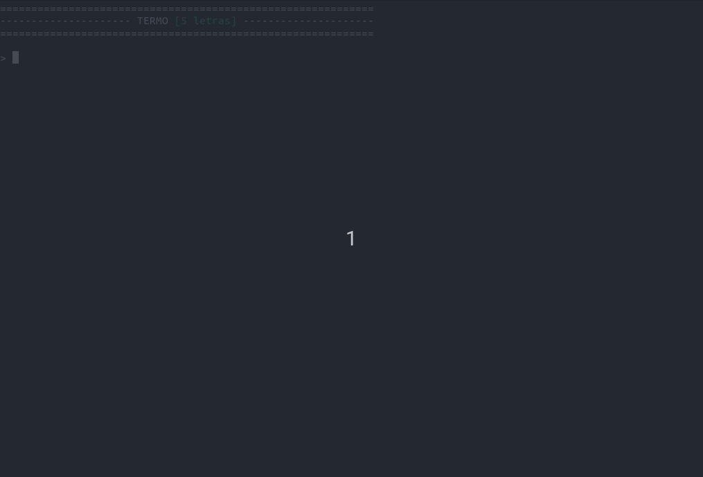

# Termo

<p align="center">
  
</p>

## Projeto

Desenvolvido durante o curso Fullstack da [Academia do Programador](https://www.academiadoprogramador.net) 2026

## Introdução

### Especificação

Neste projeto, desenvolvemos o jogo **Termo** em console utilizando C#.

O objetivo é adivinhar uma palavra secreta de 5 letras em até 5 tentativas, com feedback visual sobre as letras.

### Sobre o Sistema

- Jogador: digita palavras de 5 letras através do console
- Computador: gera uma palavra aleatória de 5 letras
- Resultado: o sistema compara as letras e fornece feedback com cores

### Regras do jogo

1. O jogador tem até 5 tentativas para adivinhar a palavra.
2. Cada letra é classificada:
   - Verde: Letra correta na posição correta
   - Amarelo: Letra correta, mas na posição errada
   - Vermelho: Letra não existe na palavra
3. O jogo termina quando a palavra é acertada ou as tentativas acabam.
4. Escolhas iguais resultam em acerto.

## Como utilizar

1. Clone o repositório ou baixe o código fonte.
2. Abra o terminal ou o prompt de comando e navegue até a pasta raiz
3. Utilize o comando abaixo para restaurar as dependências do projeto.

   ```bash
   dotnet restore
   ```

4. Para executar o projeto compilando em tempo real

   ```bash
   dotnet run --project Termo.ConsoleApp
   ```

## Requisitos

- .NET 10.0 SDK